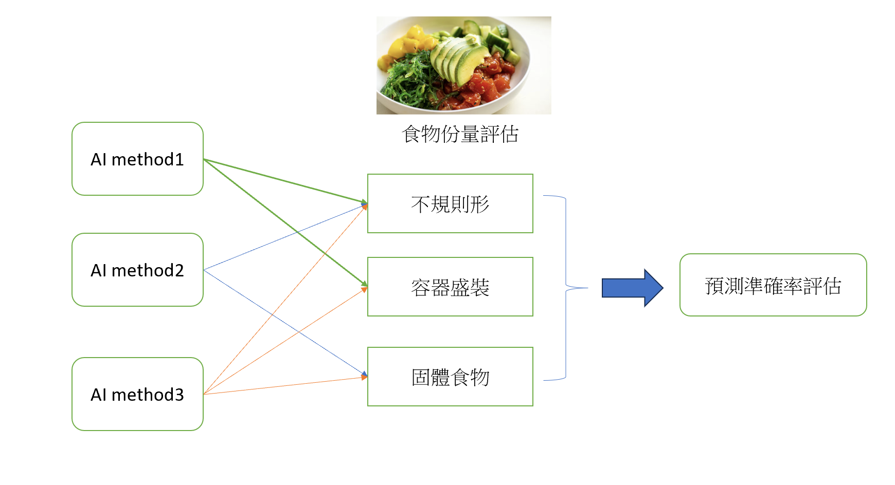

# 如何準備多篇文章的 Seminar 報告

準備多篇文章的 **seminar 報告** 是一個綜合性質的挑戰，涉及到對不同資料的整理、分析、理解以及有效的呈現。以下是如何準備此類報告的步驟與技巧：

---

## 1. 確定報告目標與重點

- **目標設定**：首先，要明確你準備報告的目的是什麼。是要介紹一個研究領域、探討某個問題的最新發展，還是展示某一技術的應用？理解這一點有助於引導你整理和呈現資料的方向。
- **挑選核心文章**：在多篇文章中，挑選出與主題最相關或具有代表性的幾篇文章，這些文章可以幫助你建立報告的框架和內容的基礎。挑選進三年的文章，且文章排序為Q1(前75%)或是Q2(前50%)
  - 學習查詢文章:請見[讓Pubmed顯示Impact factor與Ranking-Chrome擴充功能Pubmed Impact factor](https://youtu.be/inoBtbTyQ3Q)，建議查詢近期所有的文章列表，再從中挑選ranking高的文章
  - 文章最好經過指導老師審視同意。

## 2. 閱讀並分析每篇文章

- **精讀每篇文章**：對每篇文章進行詳細閱讀，重點放在以下幾個方面：  
  - **研究背景與問題**：文章中提出的研究問題及其重要性。  
  - **方法與實驗設計**：研究採用的方法與實驗設計的合理性。  
  - **結果與結論**：研究得出的主要結果，以及這些結果如何支持或挑戰現有的科學觀點。  
  - **限制與未來方向**：作者討論的研究限制與未來的研究方向。

- **記錄關鍵信息**：在閱讀過程中，做好筆記，記錄每篇文章中的關鍵數據、概念、研究方法及其創新之處。這有助於後續整合不同文章的內容。
- **AI輔助工具學習**:
  - [google NotebookLM](https://notebooklm.google/):整理文獻並對文獻進行整合提問與摘要
  - [Scite](https://scite.ai/):文獻查找與摘要
  - [chatGPT](https://chatgpt.com/):協助文獻提問、改寫與理解
  - [Napkin AI](https://www.napkin.ai/):用文字內容製作流程圖或圖例說明
## 3. 比較與綜合不同文章

- **尋找共通點與差異**：對不同文章進行比較，尋找它們之間的共通點和差異，例如：  
  - 研究問題是否一致？  
  - 是否使用了相似的方法或技術？
  - 研究對象條件的異同?
  - 國家的文化背景是否會影響研究結果
  - 各自的研究結果是否一致，或者彼此間有衝突？
  
- **建立脈絡與關聯**：將文章的結果與結論聯繫起來，找出這些研究的相互關聯。例如，某篇文章可能會深入探討一個細節問題，而另一篇文章則提出了更宏觀的視角，這兩者可以相輔相成。

## 4. 組織與結構化簡報內容

### Introduction
- 簡要介紹報告的主題及研究背景。  
- 解釋為什麼這些研究文章對該領域具有重要意義，並提供簡要的研究問題概覽。

### Motivation
- 目前這類的研究主體未被解決的問題或是存在異質結果的地方
- 說明為何挑選這些文章做報告，這些文章的重要性又為何?是否能解答想探討的問題
  
### Aims
- 說明本次報告想要探討的目的有哪些，可以畫想要看的自變項(X)與依變項(Y)之前的關聯架構圖，可以有多個X及Y

### Methods and Materials
- 比較不同文章中的方法和實驗設計，說明它們的優點和局限性。
- 比較研究對象納入條件(如:國籍、年齡、性別、等其他特殊限定條件)的異同
- 比較分析統計方法的異同

### Results
- 所有的結果呈現要有故事性，且要呼應研究目的想要探討的問題
- 整合各篇文章中的主要結果，並討論它們的意義。  
- 根據不同研究結果的異同，提出自己對該領域的看法或分析。

### Discussion
- 要呼應Results所呈現的結果，並進一步解釋推論

### Conclusion
- 總結文章中的核心發現，
 
### Comments
- 這些研究的優勢和局限性是什麼？  
- 研究中是否有不足之處，未來可以如何改進？  
- 不同研究方法是否有互補性，是否可以進一步結合？
- 基於現有的研究結果，提出自己的觀察或建議，說明如何改進現有的研究方法，或者在未來可以深入研究的方向。
## 5. 使用清晰的視覺工具

- **圖表與表格**：利用圖表、表格來清晰地展示不同文章的數據或結果比較。視覺化資料能幫助觀眾更容易理解和記住關鍵點。
- **結構圖**：製作簡單的結構圖或流程圖，幫助展示研究方法的比較，或是實驗設計的不同步驟。
- **技巧** :
  - 圖文並茂，記住"圖優於表優於文字"
  - 一頁的文字不要超過10行
  - 文字以關鍵字句呈現，而非文字。例如:台灣的十大死因，癌症名列前茅，其中又以肺癌最為重要，其發生率與盛行率均為居冠-->建議摘要為:台灣Top1癌症發生與盛行-->肺癌

## 6. 準備簡報（如果需要）

- **精簡內容**：將報告的精華內容提取出來，製作簡報。每一頁簡報應包含清晰的標題、簡單明瞭的圖表或文字，並聚焦於核心觀點。  
- **排練與演講**：在正式報告前，進行多次練習，確保自己能夠清晰、流暢地介紹每篇文章的主要內容，並能夠回答觀眾的問題。

## 7. 準備報告演講的問題與解答

- 在演講結束後，觀眾通常會提出問題。可以預先想一些潛在的問題並準備好回答，這樣有助於提高報告的專業性和自信度。

---

## 總結

- **規劃與精簡**：報告的結構要簡單明瞭，確保每篇文章的重點都能得到充分展示，同時避免信息過載。
- **批判性與綜合性思維**：對每篇文章進行批判性分析，並把它們有機地結合起來，構建出一個完整的研究故事。

這樣的準備過程能幫助你深入理解文章的核心內容並將它們有效地呈現給觀眾。
